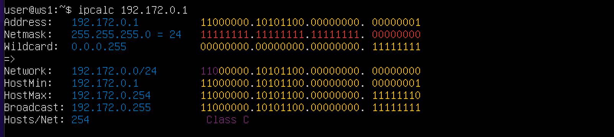
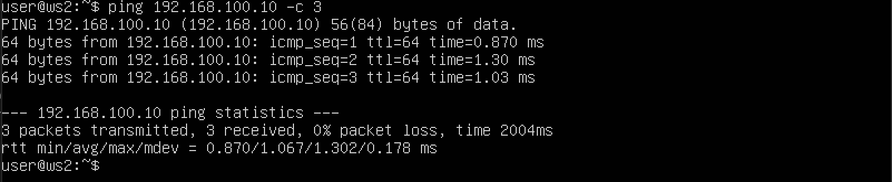
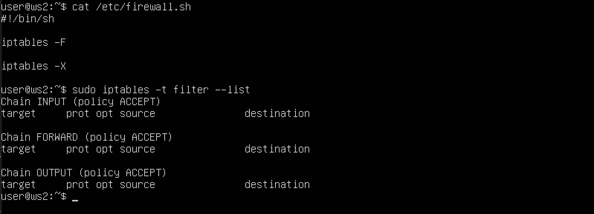
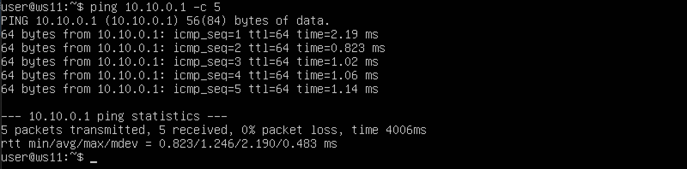
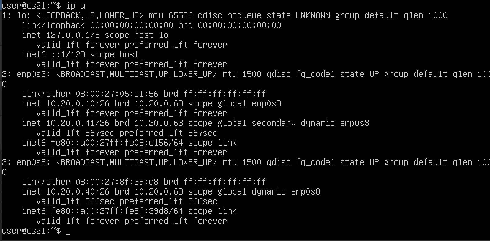
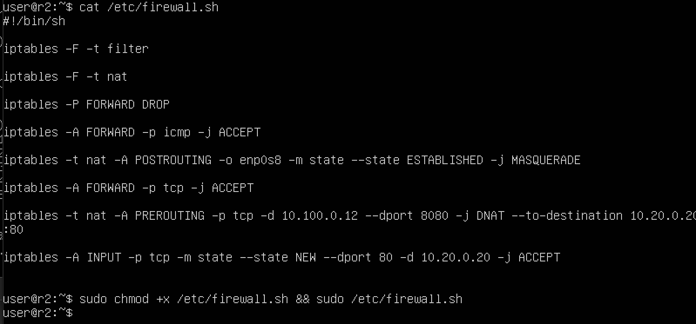

## Part 1. Инструмент **ipcalc**

**== Задание ==**

##### Поднять виртуальную машину (далее -- ws1)

#### 1.1. Сети и маски
##### Определить и записать в отчёт:
##### 1) адрес сети *192.167.38.54/13*:
-  Адрес сети в этом задании 192.160.0.0
<br>

##### 2) перевод маски *255.255.255.0* в префиксную и двоичную запись, */15* в обычную и двоичную, *11111111.11111111.11111111.11110000* в обычную и1 префиксную
- Преобразуем обычную запись сетевой маски 255.255.255.0 в префиксную и двоичную запись:
<br> Обычной записи сетевой маски 255.255.255.0 соответствует префиксная запись /24 и двоичная 1111 1111.1111 1111.1111 1111.0000 0000.


- Преобразуем префиксную запись сетевой маски */15* в обычную и двоичную:
<br>Префиксной записи сетевой маски /15 соответствует обычная запись 255.254.0.0 и двоичная 1111 1111.1111 1110.0000 0000.0000 0000.

- Преобразуем двоичную запись сетевой маски *11111111.11111111.11111111.11110000* в обычную и префиксную:
<br>Обычной записи сетевой маски соответствует префиксная запись /28 и обычная 255.255.255.240.


##### 3) минимальный и максимальный хост в сети *12.167.38.4* при масках: */8*, *11111111.11111111.00000000.00000000*, *255.255.254.0* и */4*

- 3.1) Определим адреса минимального и максимального хоста в сети 12.167.38.4 при использовании сетевой маски в префиксной форме /8:
<br>Минимальный адрес хоста будет - 12.0.0.1 и максимальный адрес хоста будет - 12.255.255.254.

- 3.2) Определим адреса минимального и максимального хоста в сети 12.167.38.4 при использовании сетевой маски в двоичной форме *11111111.11111111.00000000.00000000*:
<br>Минимальный адрес хоста будет - 12.167.0.1 и максимальный адрес хоста будет - 12.167.255.254

- 3.3) Определим адреса минимального и максимального хоста в сети 12.167.38.4 при использовании сетевой маски в обычной форме *255.255.254.0*:
<br>Минимальный адрес хоста будет - 12.167.38.1 и максимальный адрес хоста будет - 12.167.39.254

- 3.4) Определим адреса минимального и максимального хоста в сети 12.167.38.4 при использовании сетевой маски в префиксной форме /4:
<br>Минимальный адрес хоста будет - 0.0.0.1 и максимальный адрес хоста будет - 15.255.255.254.

#### 1.2. localhost
##### Определить и записать в отчёт, можно ли обратиться к приложению, работающему на localhost, со следующими IP: *194.34.23.100*, *127.0.0.2*, *127.1.0.1*, *128.0.0.1*

- *194.34.23.100*:
<br>Так как адрес принадлежит сегменту публичных адресов, то обращение к приложению, работающему на localhost, невозможно.


- *127.0.0.2*:
<br>Адрес принадлежит сегменту частных адресов и входит в сегмент looback коммуникации с localhost, значит обращение к приложению, работающему на localhost, возможно.

- *127.1.0.1*:
<br>Адрес принадлежит сегменту частных адресов и входит в сегмент looback коммуникации с localhost, значит обращение к приложению, работающему на localhost, возможно.

- *128.0.0.1*:
<br> Так как адрес принадлежит сегменту публичных адресов, то обращение к приложению, работающему на localhost, невозможно.

#### 1.3. Диапазоны и сегменты сетей
##### Определить и записать в отчёт:
##### 1) какие из перечисленных IP можно использовать в качестве публичного, а какие только в качестве частных: *10.0.0.45*, *134.43.0.2*, *192.168.4.2*, *172.20.250.4*, *172.0.2.1*, *192.172.0.1*, *172.68.0.2*, *172.16.255.255*, *10.10.10.10*, *192.169.168.1*

- *10.0.0.45*:
<br> Адрес принадлежит сегменту частных адресов, значит предложенный адрес можно использовать как частный.

- *134.43.0.2*:
<br> Адрес принадлежит сегменту публичных адресов, таким образом предложенный адрес можно использовать как публичный.

- *192.168.4.2*:
<br>Адрес принадлежит сегменту частных адресов, значит предложенный адрес можно использовать как частный.

- *172.20.250.4*:
<br>Адрес принадлежит сегменту частных адресов, значит предложенный адрес можно использовать как частный.

- *172.0.2.1*:
<br>Адрес принадлежит сегменту публичных адресов, таким образом предложенный адрес можно использовать как публичный.

- *192.172.0.1*:
<br>Адрес принадлежит сегменту публичных адресов, таким образом предложенный адрес можно использовать как публичный.

-  *172.68.0.2*:
<br>Адрес принадлежит сегменту публичных адресов, таким образом предложенный адрес можно использовать как публичный.

-  *172.16.255.255*:
<br>Адрес принадлежит сегменту частных адресов, значит предложенный адрес можно использовать как частный.

- *10.10.10.10*:
<br>Адрес принадлежит сегменту частных адресов, значит предложенный адрес можно использовать как частный.

-  *192.169.168.1*:
<br> Адрес принадлежит сегменту публичных адресов, таким образом предложенный адрес можно использовать как публичный.

##### 2) какие из перечисленных IP адресов шлюза возможны у сети *10.10.0.0/18*: *10.0.0.1*, *10.10.0.2*, *10.10.10.10*, *10.10.100.1*, *10.10.1.255*

- <br>
- **10.0.0.1** - адрес находится вне указанного сегмента адресов сети, поэтому не может являться адресом шлюза
- **10.10.0.2** - адрес находится в указанном сегменте адресов сети, поэтому может являться адресом шлюза
- **10.10.10.10** - адрес находится в указанном сегменте адресов сети, поэтому может являться адресом шлюза
- **10.10.100.1** - адрес находится вне указанного сегмента адресов сети, поэтому не может являться адресом шлюза
- **10.10.1.255** - адрес находится в указанном сегменте адресов сети, поэтому может являться адресом шлюза

## Part 2. Статическая маршрутизация между двумя машинами

- С помощью команды `ip a` посмотрели существующие сетевые интерфейсы на ws1 и ws2: 
<br>
<br>

- Описали сетевой интерфейс, соответствующий внутренней сети, на обеих машинах и задали следующие адреса и маски: ws1 - 192.168.100.10, маска /16, ws2 - 172.24.116.8, маска /12:
<br>
<br>

- Выполнили команду netplan apply для перезапуска сервиса сети:
<br>
<br>

#### 2.1. Добавление статического маршрута вручную
- Добавили статический маршрут от одной машины до другой и обратно при помощи команды вида `ip r add`:
<br>
<br>

- Пропинговали соединение между машинами:
<br>
<br>

#### 2.2. Добавление статического маршрута с сохранением

- Перезапустили машины командой `reboot`.
Добавили статический маршрут от одной машины до другой с помощью файла *etc/netplan/00-installer-config.yaml*
<br>
<br>

- Еще раз пропинговали соединение между машинами: 
<br>
<br>

## Part 3. Утилита **iperf3**

#### 3.1. Скорость соединения
##### Перевести и записать в отчёт: 8 Mbps в MB/s, 100 MB/s в Kbps, 1 Gbps в Mbps:

- 8 Mbps = 1 MB/s
- 100 MB/s = 819200 kbps
- 1 Gbps = 1024 Mbps


#### 3.2. Утилита **iperf3**
##### Измерить скорость соединения между ws1 и ws2:

- ws1 - сервер, а ws2 - рабочая станция с которой осуществляется связь:
<br>
<br>

- ws2 - сервер, а ws1 - рабочая станция с которой осуществляется связь:
<br>
<br>

- В результате успешно измерили скорость соединения между двумя рабочими станциями **ws1 и ws2**.

## Part 4. Сетевой экран

#### 4.1. Утилита **iptables**
##### Создать файл */etc/firewall.sh*, имитирующий фаерволл, на ws1 и ws2:
```shell
#!/bin/sh

# Удаление всех правил в таблице "filter" (по-умолчанию).
iptables –F
iptables -X
```
##### Нужно добавить в файл подряд следующие правила:
##### 1) на ws1 применить стратегию когда в начале пишется запрещающее правило, а в конце пишется разрешающее правило (это касается пунктов 4 и 5)
##### 2) на ws2 применить стратегию когда в начале пишется разрешающее правило, а в конце пишется запрещающее правило (это касается пунктов 4 и 5)
##### 3) открыть на машинах доступ для порта 22 (ssh) и порта 80 (http)
##### 4) запретить *echo reply* (машина не должна "пинговаться”, т.е. должна быть блокировка на OUTPUT)
##### 5) разрешить *echo reply* (машина должна "пинговаться")

- на обоих машинах нет правил iptables: 
<br>
<br>

- Создадим bash-скрипты, которые добавят набор правил в **iptables** для **ws1** и **ws2** (набор правил дан нам этим заданием):
<br>
<br>

- Запустим файлы на обеих машинах командами chmod +x /etc/firewall.sh и /etc/firewall.sh и проверим таблицу правил:
<br>
<br>

- Пояснение: Для двух машин, ws1 и ws2, используются различные стратегии для правил цепочки OUTPUT в iptables. Для ws1, правило для исходящего трафика протокола ICMP, который используется утилитой ping, сначала блокируется, а затем разрешается. Это означает, что при пинговании ws1, ответы (эхо) не будут выходить, так как первое правило в цепочке OUTPUT заблокирует все исходящие ответы. В то же время, для ws2 ситуация будет противоположной, поскольку "эхо" (ответ) от ping будет пропускаться iptables. Первое правило в цепочке правил, которые выполняется, пропускает все следующие правила в той же цепочке, так что две стратегии для цепочки правил OUTPUT для двух машин действуют по-разному (либо блокируют пинг-ответы, либо пропускают).

#### 4.2. Утилита **nmap**
- Пропингуем соединение между машинами и протестируем утилитой nmap:
<br>
<br>

- Из результатов тестирования видно, что ping-запросы с одной машины (ws1) к другой (ws2) проходят, и ответы на них возвращаются успешно. Однако, когда пинг происходит в обратном направлении (от ws2 к ws1), ответы подавляются на стороне ws1, что приводит к тому, что эхо (ответ) на пинг не возвращается.
Тем не менее, сканирование сети с помощью утилиты nmap показывает, что обе машины функционируют и "видны" друг для друга, что указывает на то, что правила iptables правильно настроены и работают

## Part 5. Статическая маршрутизация сети

##### Поднять пять виртуальных машин (3 рабочие станции (ws11, ws21, ws22) и 2 роутера (r1, r2))

#### 5.1. Настройка адресов машин
##### Настроить конфигурации машин в *etc/netplan/00-installer-config.yaml* согласно сети на рисунке.

- Сконфигурировали машины согласно условию задания. Перезапустили службу сети, чтобы все изменения вступили в силу и сделали проверку адресов машин с помощью команды `$ip -4 a**`:
<br>
<br>
<br>
<br>
<br>

- Пропинговали ws22 с ws21 и r1 с ws11:
<br>
<br>

#### 5.2. Включение переадресации IP-адресов.
- Для включения переадресации IP, выполнили команду `sysctl -w net.ipv4.ip_forward=1` на роутерах:
<br>
<br>

- Откройте файл /etc/sysctl.conf и добавили в него следующую строку:
`net.ipv4.ip_forward = 1` для включения IP-переадресация на постоянной основе:
<br>
<br>

#### 5.3. Установка маршрута по-умолчанию

- Добавили маршрут по умолчанию для трёх рабочих станций. Внесли изменения в конфигурационный файл, перезапустили сетевую службу и проверили конфигурацию с помощью $ip r.
<br>
<br>
<br>

- Пропинговали с ws11 роутер r2 и показали на r2, что пинг доходит. Для этого использовали команду `tcpdump -tn -i enp0s3`:
<br>
<br>

#### 5.4. Добавление статических маршрутов

- Добавили в роутеры r1 и r2 статические маршруты в файле конфигураций, вызвали `ip r` и показали таблицы с маршрутами на обоих роутерах:
<br>
<br>

- Запустили команды `ip r list 10.10.0.0/[маска сети]` и `ip r list 0.0.0.0/0` на ws11:
<br>

- Пояснение: Обращение к адресам, принадлежащим той же сети, что и машина, будет обработано маршрутным правилом, соответствующим этой сети. Адреса, не входящие в сеть машины, будут переданы на обработку маршрутизатору по умолчанию, то есть вовне сети хоста. Поэтому, запрос к адресу 10.10.0.0/18 был обработан как запрос в сети хоста 10.10.0.0, а запрос с адресами 0.0.0.0/0 не входящим в сеть машины (хоста), был передан маршрутизатору по умолчанию 

#### 5.5. Построение списка маршрутизаторов

- Отследим прохождение запросов в нашей сети по маршрутизаторам с помощью команды **traceroute**:
<br>
<br>

- Пояснение: traceroute посылает три пакета и отслеживает их прохождения через маршрутизаторы. Время при прохожения и отклике увеличивается на равный промежуток пропорционально пройденным маршрутизаторам до того момента, пока заданный адрес хоста не будет достигнут.

#### 5.6. Использование протокола **ICMP** при маршрутизации

- Запустим на r1 перехват сетевого трафика и пропингуем с ws11 несуществующий IP (например, *10.30.0.111*) с помощью команды:
<br>
<br>

## Part 6. Динамическая настройка IP с помощью **DHCP**


- Указали адрес маршрутизатора по-умолчанию, DNS-сервер и адрес внутренней сети для r2:
<br>

- В файле *resolv.conf* прописали `nameserver 8.8.8.8.`:
<br>

- Перезагрузили службу **DHCP** командой `systemctl restart isc-dhcp-server`. Машину ws21 перезагрузили при помощи `reboot` и через `ip a` показали, что она получила адрес. Также пропинговали машины ws22 и ws21:
<br>
<br>
<br>

- Указали MAC адрес у ws11, для этого в *etc/netplan/00-installer-config.yaml*  добавили строки: `macaddress: 10:10:10:10:10:BA`, `dhcp4: true`:
<br>

- Для r1 настроили аналогично r2, но выдачу адресов сделали с жесткой привязкой к MAC-адресу (ws11). Провели аналогичные тесты:
<br>
<br>
<br>
<br>
<br>

- Запросить с ws21 обновление ip адреса:
<br>
<br>
<br>

- Пояснение: как видно на скриншоте выше, для смены IP адреса был выполнен полный цикл запросов и ответов между DHCP сервером и DHCP клиентом. А именно был произведён обмен DHCPDISCOVER, DHCPOFFER, DCHPREQUEST и DCHPACK. DHCP сервер при этом использовал все свои настройки - сетевой сегмент, покрываемый сервером, адреса внутренней сети (в которой будут раздаваться динамические IP адреса), маршрутизатора по-умолчанию, и DNS-сервера.

- Результат: успешно настроены и запущены DHCP сервера на маршрутизаторах в двух сегментах сети для динамического выделения IP адресов хостам в этих сегментах.


## Part 7. **NAT**

- В файле /etc/apache2/ports.conf на ws22 и r1 изменили строку Listen 80 на Listen 0.0.0.0:80:
<br>
<br>

- Запустили веб-сервер Apache командой service apache2 start на ws22 и r1:
<br>
<br>

- Создадим скрипт-файл с правилами для межсетевого экрана iptables и запустим:
<br>

- Посмотрим созданные правила в таблицах iptables:
<br>

- Проверим соединение между ws22 и r1 командой `ping`.
<br>

- Добавим ещё одно правило в iptables позволяющее маршрутизировать все пакеты протокола icmp:
<br>

- Пропингуем соединение:
<br>

- Добавим правила SNAT и DNAT и посмотри их в таблице:
<br>
<br>

- Проверим действие правила SNAT, доступ к веб-серверу на r1 открыт:
<br>

- Проверим действие правила DNAT - обращение к веб-серверу ws22 успешно переадресовано с r1 используя порт 8080.
<br>